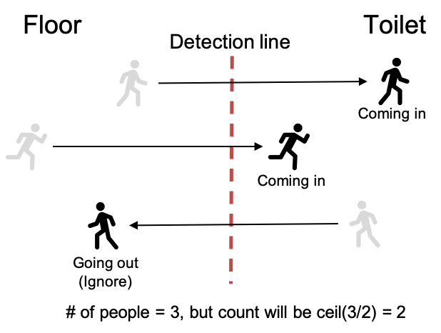
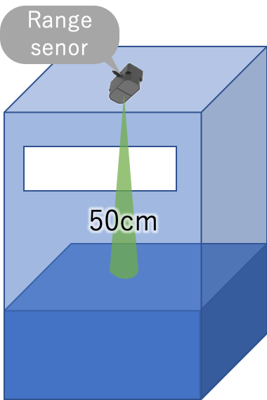

# Edge data collector
This repository contains sensor data collectors on edge side for COVSAFE.
* Data collectors monitor and gather data from various types of sensors.
* We use Fluentd to send the collected data to [IBM Cloud Event Streams](https://www.ibm.com/cloud/event-streams).
* The uploaded data will be stored in IBM Cloud Cloudant, and will be used for further process of COVSAVE.


# Data collectors and installation
Currently, COVSAE has 3 types of data collectors to monitor people congestion level or sanitization status in the targeted buildings or floors. To install and use these data collectors, please see the following links.
### Congestion
  * Area and line based people counter
    * HLDS LiDAR (ToF) series: [area_line_people_counter](area_line_people_counter)

### Sanitization
* Hand wash activity monitor
  * HLDS LiDAR (ToF) series: [handwash_monitor](handwash_monitor)

* Garbage bin monitor
  * Seeed TFmini series: [garbage_bin_monitor](garbage_bin_monitor)


# Sensor data formats
* Upload simple and minimum raw data.
* Make it possible to use same format even if other type of sensors are introduced.

## Data from Sensor/edge device to Event Streams


### Basic elements in data
* deviceType: Type of the sensors. One of the area_people_counter, line_people_counter, handwash_monitor or garbage_bin_monitor should be give.
* deviceId:   ID of the sensor. You can find this from [asset.json in the delivery repository](https://github.com/Hitachi-CTI-Call-For-Code-COVID-19-Team/delivery/blob/master/data/tenants/c4c/cloudant/assets.json)
* eventType:  "send_data" (static)
* time: Time information in ISO 8601 format.
* data:       Sensor data 
* payload: Payload of sensor data. Format and contents are depend on sensor type. See the following sections.

### Example
```json
{
  "deviceType": "area_people_counter",
  "deviceId": "area_people_counter-0001",
  "eventType": "send_data",
  "data": {
    "time": "2020-06-04T13:50:40+09:00",
    "payload": {
      ...
    }
  }
}
```

## Area people counter
A sensor which counts the number of people in a specific area during a certain period of time.


### Elements in the data object
* count: The number of people in a specific area during a certain period of time.
* area: The id of the targeted area. The sensor should be corresponded to an specific area asset information on cloud side with this area id. If the sensor is HLDS ToF, the count indicates the maximum number of people during the monitoring period. 
* period: Monitoring time period in milliseconds.

### Examples
```json
{
  "time": "2020-06-04T13:50:40+09:00",
  "payload": {
    "area": "area-xxx-xxx",
    "count": 10,
    "period": 10000
  }
}
```

## Line people counter
A sensor which counts the number of people passed on a specific detection line in a certain period of time. This can use for counting how many people used toilet. But currently, we don't have bi-directional line sensors. So to ignore the going out people, sensor will ceil the the number of passed people and reports it. For example, if 3 people passed the detection line, sensor reports 2 (ceil(3/2)). (We have to take care about bi-directional sensors in the future)

</img><br/>

### Elements in the data object
* area: The asset id of targeted area. The sensor should be corresponded to an specific area asset information on cloud side with this area id. 
* count: The number of people who passed the detection line at in certain period of time. If the sensor is HLDS ToF, to avoid duplicate counts of in-coming and going-out people, sensor will ceil the the number of passed people and reports it.
* period: Monitoring time period in milliseconds.

### Examples
```json
{
  "time": "2020-06-04T13:50:40+09:00",
  "payload": {
    "area": "area-yyy-yyy",
    "count": 10,
    "period": 10000
  }
}
```

## Hand wash activity counter
A sensor which counts the number of people who washed their hands in a certain period time.

### Elements in the data object
* handwashStand: The asset id of targeted handwash stand. The sensor data should be corresponded to the specific stand asset information on cloud side with this id.
* count: The number of people who washed their hands in a certain time. The monitoring place should be corresponded on cloud side using area_id. If the sensor is HLDS ToF, hand wash activities are detected when his/her hand touches around of the specific faucet.
* period: Monitoring time period in milliseconds.

### Examples
```json
{
  "time": "2020-06-04T13:50:40+09:00",
  "payload": {
    "handwashStand": "handwash_stand-xxx-xxx",
    "count": 10,
    "period": 10000
  }
}
```
<a name="garbage_bin"></a>
## Garbage bin monitor
A sensor which monitors the distance from the roof of a garbage bin to the top of the accumulated garbages inside. This indicates how much amount of the garbages are accumulated and cloud side service can report when should the garbage bin cleaned. Note that cloud side service should manage which sensor and garbage bin are corresponding. Also, they should manage the distance when the garbage bin is empty to calculate the percentage of accumulated garbages against the amount of the garbage bin.

</img><br/>

### Elements in the data object
* garbageBin: The asset id of a targeted garbage bin. The sensor data should be corresponded to the specific garbage bin asset information on cloud side with this id. 
* distance: A distance from the roof of a garbage bin to the top of the accumulated garbages inside. The unit is cm.
* max_depth: (FOR DEMO ONLY) Depth of each garbage bin in cm.
* amount_rate: (FOR DEMO ONLY) Percentage of the garbage amount. 

### Examples
```json
{
  "time": "2020-06-04T13:50:40+09:00",
  "payload": {
    "garbageBin": "garbage_bin-xxx-xxx",
    "distance": 23,
    "max_depth": 100,
    "amount_rate": 77
  }
}
```


